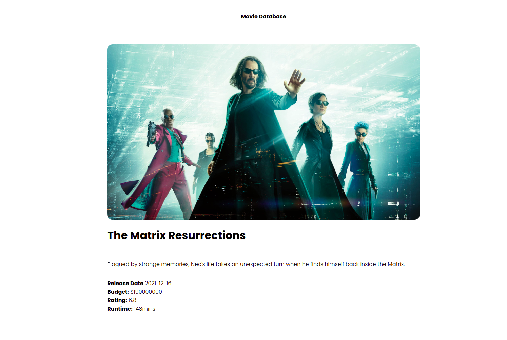

# Movies DB Web Application

### _Movies DB Web App developed using SveltKit, SveltJs and TMDB API_

### :link:

### Learned from : [Dev Ed](https://youtu.be/ydR_M0fw9Xc)

### TMDB Account: [link to account](https://www.themoviedb.org/u/developerjunaid)

## Images

## Run Locally

- Run this command `git clone https://github.com/developer-junaid/Web3.0-Crypto-Website.git`
- You are now in the dev environment and you can play around

## Technologies

- HTML
- CSS
- SveltJs (Javascript Framework)
- SveltKit (Svelte Framework)
- TMDB (For movies API)
